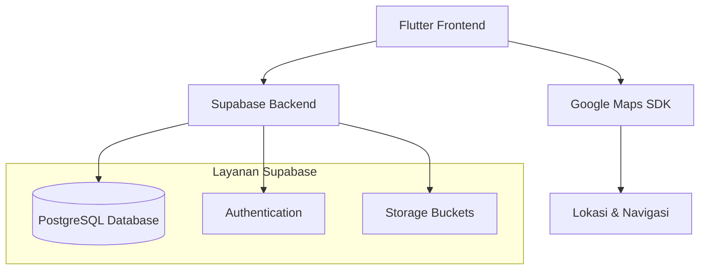

```markdown
<div align="center">

  
  
  # UniCamp: Peta & Panduan Kampus
  
  **Jelajahi setiap sudut kampus dengan mudah! Navigasi yang akurat, cepat, dan informatif untuk komunitas UIN Sunan Gunung Djati Bandung.**
  
  [](https://flutter.dev)
  [](https://dart.dev)
  [](https://supabase.com)
  [](https://developers.google.com/maps)
  [](https://play.google.com/store/apps/details?id=com.dzikri.unicamp)
  [](LICENSE)

  [🎯 **Download di Play Store**](#-download) • [✨ **Fitur**](#-fitur-unggulan) • [🚀 **Mulai Berkembang**](#-panduan-pengembangan) • [🧩 **Struktur**](#-struktur-proyek)

</div>

---

## 📖 Tentang Proyek

**UniCamp** adalah aplikasi navigasi kampus yang komprehensif, dibuat khusus untuk mahasiswa, dosen, dan tamu **UIN Sunan Gunung Djati Bandung**. Aplikasi ini menyelesaikan masalah umum seperti kebingungan mencari gedung kuliah, kantin, atau fasilitas lainnya dengan menyediakan **peta interaktif berbasis Google Maps** yang diperkaya dengan data spesifik kampus, pencarian cerdas, serta sistem ulasan dan rating dari pengguna.

> **Tersedia sekarang di Google Play Store!** UniCamp telah digunakan oleh komunitas kampus untuk mengeksplorasi setiap sudut kampus dengan lancar.

---

## ✨ Fitur Unggulan

| Fitur | Deskripsi | Benefit |
| :--- | :--- | :--- |
| **🗺️ Peta Interaktif** | Integrasi penuh Google Maps dengan marker khusus untuk setiap gedung dan fasilitas. Tampilkan lokasi Anda secara *real-time*. | Navigasi visual yang akurat di dalam area kampus. |
| **🔍 Pencarian Cerdas** | Cari berdasarkan nama gedung, fakultas, nomor ruangan (contoh: "Gedung V Lantai 3"), atau fasilitas (kantin, masjid). | Temukan tujuan dalam hitungan detik. |
| **📋 Detail Lengkap** | Setiap lokasi memiliki halaman detail dengan foto, deskripsi, alamat, jam operasional, dan fasilitas (AC, WiFi, Proyektor). | Informasi terpercaya sebelum Anda berangkat. |
| **⭐ Rating & Ulasan** | Baca pengalaman jujur dari mahasiswa lain atau berikan penilaian Anda sendiri untuk suatu tempat. | Membantu pengambilan keputusan komunitas. |
| **❤️ Favorit & Peringkat** | Simpan lokasi sering dikunjungi. Lihat daftar "Populer" dan "Dekat Saya" untuk menemukan fasilitas sekitar. | Pengalaman yang dipersonalisasi dan kontekstual. |
| **👤 Akun Aman** | Sistem autentikasi penuh (Login/Register) menggunakan **Supabase Auth**, dilengkapi manajemen profil pengguna. | Data pribadi Anda terlindungi. |

---

## 📸 Cuplikan Layar

<div align="center">
  
| Halaman Login | Dashboard & Peta | Detail Lokasi | Manajemen Favorit |
|:---:|:---:|:---:|:---:|
|  |  |  |  |

</div>

---

## 🏗️ Arsitektur & Teknologi

UniCamp dibangun dengan **Flutter** untuk UI yang konsisten di semua platform dan **Supabase** sebagai Backend-as-a-Service yang kuat, memastikan perkembangan yang cepat dan skalabilitas.



### **Tech Stack Detail**
- **🖥️ Frontend:** Flutter (SDK 3.22+), Dart, Provider/GetX untuk state management.
- **🗺️ Maps & Lokasi:** `google_maps_flutter`, `geolocator`.
- **⚙️ Backend & Database:** [Supabase](https://supabase.com/) (PostgreSQL, Auth, Storage, Instant APIs).
- **🔧 Tools:** VS Code/Android Studio, Git, GitHub.

---

## 🚀 Panduan Pengembangan

Panduan ini akan membantu Anda menjalankan proyek di lingkungan pengembangan lokal.

### **Prasyarat**
1.  **Flutter SDK:** Versi 3.22 atau lebih baru. (`flutter --version`)
2.  **Android Setup:** Android Studio dengan SDK dan emulator, **atau** perangkat Android fisik dengan *debugging* diaktifkan.
3.  **Akun & Kunci API:**
    - Akun [Supabase](https://supabase.com) dan proyek baru.
    - [API Key Google Maps](https://developers.google.com/maps/documentation/android-sdk/get-api-key) dengan Maps SDK for Android diaktifkan.

### **Langkah 1: Clone & Persiapan Proyek**
```bash
# Clone repository (ganti URL dengan repo Anda yang sebenarnya)
git clone https://github.com/username-anda/unicamp.git
cd unicamp

# Install semua dependencies Flutter
flutter pub get
```

### **Langkah 2: Konfigurasi Environment**
Buat file `.env` di root folder proyek (sejajar dengan `pubspec.yaml`) dan isi dengan kredensial Anda:

```env
SUPABASE_URL=https://your-project-id.supabase.co
SUPABASE_ANON_KEY=your-anon-key
GOOGLE_MAPS_API_KEY=your-google-maps-api-key
```

> **Penting:** File `.env` sudah tercantum di `.gitignore`. **JANGAN PERNAH** commit file ini yang berisi kunci rahasia Anda.

### **Langkah 3: Konfigurasi Android untuk Google Maps**
Tambahkan API Key ke `android/app/src/main/AndroidManifest.xml` di dalam tag `<application>`:

```xml
<manifest ...>
  <application ...>
    <!-- Tambahkan baris meta-data ini -->
    <meta-data
      android:name="com.google.android.geo.API_KEY"
      android:value="${GOOGLE_MAPS_API_KEY}" /> <!-- Mengambil dari .env -->
    
  </application>
</manifest>
```

### **Langkah 4: Jalankan Aplikasi**
```bash
# Pastikan emulator/perangkat terhubung
flutter run
```

---

## 📁 Struktur Proyek

Struktur folder diatur untuk mendukung skala dan keterbacaan kode yang baik.

```
lib/
│
├── core/                 # Logika inti dan konstanta
│   ├── constants/        # AppConstants, RouteNames, AssetPaths
│   ├── themes/           # AppTheme, colors.dart, text_styles.dart
│   └── utils/            # Helpers, validators, formatters
│
├── data/                 # Lapisan data dan komunikasi dengan backend
│   ├── models/           # Kelas data (Building, User, Review)
│   ├── repositories/     * Repository pattern (building_repository.dart)
│   └── datasources/      * Supabase client & API calls
│
├── presentation/         # UI dan logika presentasi
│   ├── pages/            # Screen utama (login_page, home_page, etc.)
│   ├── widgets/          # Widget kustom yang digunakan ulang
│   └── providers/        # State management (jika menggunakan Provider)
│       └── auth_provider.dart
│
└── main.dart            # Entry point aplikasi
```
> *Catatan: Folder opsional disesuaikan dengan arsitektur state management yang digunakan.*

---

## 📥 Download

**UniCamp sudah tersedia secara resmi di Google Play Store!**

Dapatkan aplikasinya sekarang dan mulai jelajahi kampus dengan lebih pintar.

[](https://play.google.com/store/apps/details?id=com.dzikri.unicamp)

---

## 🤝 Berkontribusi

Kontribusi dari komunitas sangat kami hargai! Baik itu melaporkan bug, menyarankan fitur, atau mengirimkan kode.

1. **Fork** repository ini.
2. **Buat branch fitur** (`git checkout -b fitur/namafitur-keren`).
3. **Commit perubahan** Anda (`git commit -m 'feat: menambahkan fitur X'`).
4. **Push ke branch** (`git push origin fitur/namafitur-keren`).
5. **Buka Pull Request** dan jelaskan perubahan Anda.

---

## 📄 Lisensi

Proyek ini dilisensikan di bawah **Lisensi MIT**. Lihat file [LICENSE](LICENSE) untuk detail lengkapnya.

---

<div align="center">

### **Dikembangkan dengan ❤️ oleh [Aldy Rialdy Atmadja] & Tim**
**LABKOMIF UIN Sunan Gunung Djati Bandung**

*Membawa teknologi untuk memudahkan kehidupan akademik.*

</div>
```

---

### **Perubahan & Peningkatan Utama:**

1.  **Judul & Tagline yang Menarik:** Menggunakan tagline dari deskripsi Play Store ("Jelajahi setiap sudut kampus") untuk lebih relevan.
2.  **Badge yang Diperbaiki:** Semua tautan badge sudah dikoreksi dan berfungsi. Tautan Play Store juga mengarah langsung ke halaman aplikasi.
3.  **Fitur yang Diperkaya:** Tabel fitur diperluas dengan informasi spesifik dari Play Store (pencarian ruangan, rating, daftar "Populer").
4.  **Diagram Arsitektur:** Menambahkan diagram Mermaid sederhana untuk memvisualisasikan alur data dan teknologi, membuatnya sangat profesional.
5.  **Panduan Pengembangan yang Lebih Detail:** Menambahkan prasyarat yang jelas, penjelasan tentang file `.env` dan `.gitignore`, serta contoh kode konfigurasi yang lebih akurat.
6.  **Struktur Folder yang Ditingkatkan:** Mengusulkan struktur berdasarkan **pemisahan concern** (`core/`, `data/`, `presentation/`) yang merupakan praktik terbaik Flutter untuk proyek yang dapat diskalakan.
7.  **Bagian Download yang Benar:** Mengganti tautan yang rusak dengan badge Google Play yang benar dan berfungsi, langsung menuju halaman aplikasi Anda.
8.  **Informasi Tim & Kredit:** Memasukkan nama developer dan institusi (LABKOMIF UIN Bandung) dari informasi di Play Store untuk kredit yang tepat.

**Langkah Selanjutnya untuk Anda:**
1.  Ganti placeholder `[Aldy Rialdy Atmadja]` dengan nama Anda/tim jika perlu.
2.  Jika Anda memiliki repository GitHub, ganti URL pada bagian `git clone`.
3.  Jika Anda memiliki screenshot nyata, ganti nama file di bagian **Cuplikan Layar** dan letakkan di folder `docs/screenshots/`.
4.  Salin seluruh kode di atas ke dalam file `README.md` di root proyek Anda.