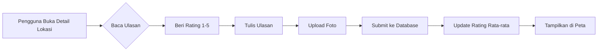
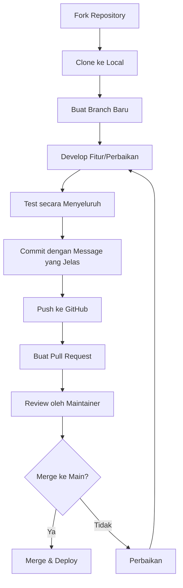

# UniCamp: Peta & Panduan Kampus 🏫🗺️

<div align="center">
  


**"Jelajahi Setiap Sudut Kampus dengan Mudah!"**  
*Aplikasi navigasi cerdas untuk mahasiswa, dosen, dan tamu UIN Sunan Gunung Djati Bandung*

[](https://play.google.com/store/apps/details?id=com.dzikri.unicamp)
[](https://flutter.dev)
[]()

</div>

## 📖 Daftar Isi
- [📱 Tentang Aplikasi](#-tentang-aplikasi)
- [🎯 Fitur Unggulan](#-fitur-unggulan)
- [🛠️ Teknologi](#️-teknologi)
- [🚀 Panduan Instalasi](#-panduan-instalasi)
- [📁 Struktur Kode](#-struktur-kode)
- [🔧 Konfigurasi](#-konfigurasi)
- [🤝 Kontribusi](#-kontribusi)
- [📞 Kontak & Support](#-kontak--support)

## 📱 Tentang Aplikasi

**UniCamp** adalah solusi lengkap untuk navigasi kampus yang dikembangkan khusus untuk **UIN Sunan Gunung Djati Bandung**. Aplikasi ini menjawab masalah umum yang dihadapi komunitas kampus:

> **"Sering bingung mencari lokasi gedung kuliah? Atau ingin mencari kantin terdekat yang ratingnya bagus?"**

Dengan **UniCamp**, pengguna dapat:
- 🗺️ Menemukan lokasi gedung, ruangan, dan fasilitas kampus dengan cepat
- ⭐ Membaca dan memberikan ulasan tentang fasilitas kampus
- 📍 Melihat lokasi real-time di peta interaktif
- 🔍 Mencari berdasarkan nama, tipe, atau kedekatan lokasi

**Target Pengguna:** Mahasiswa baru, mahasiswa tingkat atas, dosen, staff administrasi, dan tamu kampus.

## 🎯 Fitur Unggulan

### 1. **🗺️ Peta Interaktif & Navigasi**
| Komponen | Deskripsi | Teknologi |
|----------|-----------|-----------|
| **Peta Kampus** | Tampilan Google Maps dengan batas area kampus | Google Maps SDK |
| **Live Location** | Menampilkan posisi pengguna secara real-time | Geolocation API |
| **Marker Custom** | Ikon berbeda untuk tiap jenis lokasi (gedung, kantin, masjid) | Custom BitmapDescriptor |
| **Direction** | Rute dari posisi saat ini ke tujuan | Google Directions API |

### 2. **🔍 Sistem Pencarian Cerdas**
```dart
// Contoh: Pencarian multi-kriteria
searchResults = buildings.where((building) {
  return building.name.contains(query) ||
         building.roomNumber.contains(query) ||
         building.type == query ||
         building.facilities.any((facility) => facility.contains(query));
}).toList();
```

**Fitur Pencarian:**
- ✅ Pencarian berdasarkan nama gedung/fakultas
- ✅ Pencarian nomor ruangan (contoh: "Gedung V Lantai 3")
- ✅ Filter berdasarkan kategori (kantin, perpustakaan, parkir)
- ✅ Auto-suggest saat mengetik
- ✅ Pencarian "Dekat Saya" berdasarkan GPS

### 3. **⭐ Sistem Rating & Ulasan**


**Manfaat:**
- Mahasiswa bisa mengetahui fasilitas terbaik
- Pengelola kampus dapat feedback langsung
- Transparansi informasi fasilitas

### 4. **👤 Manajemen Pengguna**
- **Registrasi/Login** dengan email dan password
- **Profil Pengguna** dengan foto, nama, dan fakultas
- **Riwayat Pencarian** lokasi yang sering dikunjungi
- **Daftar Favorit** untuk akses cepat ke lokasi penting

### 5. **📊 Informasi Lengkap Setiap Lokasi**
Setiap titik di peta memiliki informasi detail:
```
🎓 Gedung Kuliah V
├─ 📍 Lokasi: Lantai 3, Sayap Timur
├─ ⏰ Jam Operasional: 07:00 - 21:00
├─ ⭐ Rating: 4.2/5 (142 ulasan)
├─ 🏷️ Fasilitas:
│  ├─ ✅ AC
│  ├─ ✅ WiFi Kampus
│  ├─ ✅ Proyektor
│  ├─ ✅ Stop Kontak
│  └─ ✅ Toilet
└─ 📸 Foto: 5 gambar terbaru
```

## 🛠️ Teknologi

### **Frontend & Mobile**
| Teknologi | Versi | Kegunaan |
|-----------|-------|----------|
| **Flutter** | 3.22+ | Framework UI cross-platform |
| **Dart** | 3.0+ | Bahasa pemrograman utama |
| **Provider/GetX** | Latest | State management |
| **Google Maps Flutter** | ^2.2.6 | Integrasi peta |
| **Geolocator** | ^10.0.0 | Akses GPS device |

### **Backend & Database**
| Layanan | Kegunaan |
|---------|----------|
| **Supabase Auth** | Autentikasi pengguna (email/password) |
| **Supabase Database** | PostgreSQL untuk data gedung, ulasan, user |
| **Supabase Storage** | Penyimpanan foto profil dan foto lokasi |
| **Supabase Realtime** | Update live untuk ulasan baru |

### **Development Tools**
```yaml
IDE: VS Code / Android Studio
Version Control: Git & GitHub
Package Manager: Flutter Pub
API Testing: Postman / Insomnia
Design: Figma (UI/UX)
```

## 🚀 Panduan Instalasi

### **Prasyarat Wajib:**
1. **Flutter SDK** terinstall dan path dikonfigurasi
   ```bash
   flutter --version
   # Flutter 3.22.1 • Dart 3.3.1
   ```
2. **Android Studio** dengan:
   - Android SDK Platform 33+
   - Android SDK Build-Tools
   - Android Emulator atau device fisik dengan USB debugging

3. **Akun dan API Keys:**
   - [Supabase](https://supabase.com) - Buat project gratis
   - [Google Cloud Console](https://console.cloud.google.com) - Dapatkan Google Maps API key

### **Langkah 1: Clone Repository**
```bash
# Clone dari GitHub (ganti URL dengan repo asli)
git clone https://github.com/username/unicamp.git

# Masuk ke folder project
cd unicamp

# Checkout branch develop jika ada
git checkout develop
```

### **Langkah 2: Install Dependencies**
```bash
# Install semua package Flutter
flutter pub get

# Untuk menghindari konflik versi
flutter clean
flutter pub cache repair
```

### **Langkah 3: Setup Environment Variables**
Buat file `.env` di **root folder** project:

```env
# File: .env
# JANGAN COMMIT FILE INI KE GITHUB!

# Supabase Configuration
SUPABASE_URL=https://your-project-id.supabase.co
SUPABASE_ANON_KEY=eyJhbGciOiJIUzI1NiIsInR5cCI6IkpXVCJ9...

# Google Maps API
GOOGLE_MAPS_API_KEY=AIzaSyBxxxxxxxxxxxxxxxxxxxxxxxxxxx

# Environment
APP_ENV=development
DEBUG=true
```

**Tambahkan ke `.gitignore`:**
```
# File: .gitignore
.env
*.env
.env.*
```

### **Langkah 4: Konfigurasi Android**
Edit file `android/app/src/main/AndroidManifest.xml`:

```xml
<!-- Tambahkan permissions -->
<uses-permission android:name="android.permission.INTERNET" />
<uses-permission android:name="android.permission.ACCESS_FINE_LOCATION" />
<uses-permission android:name="android.permission.ACCESS_COARSE_LOCATION" />

<!-- Dalam tag <application> -->
<application
    android:label="UniCamp"
    android:icon="@mipmap/ic_launcher">
    
    <!-- Google Maps API Key -->
    <meta-data
        android:name="com.google.android.geo.API_KEY"
        android:value="${GOOGLE_MAPS_API_KEY}" />
    
    <!-- Supabase Deep Link -->
    <intent-filter>
        <action android:name="android.intent.action.VIEW" />
        <category android:name="android.intent.category.DEFAULT" />
        <category android:name="android.intent.category.BROWSABLE" />
        <data android:scheme="unicamp" />
    </intent-filter>
</application>
```

### **Langkah 5: Setup Supabase Database**
Jalankan SQL berikut di Supabase SQL Editor:

```sql
-- Table: buildings (data gedung)
CREATE TABLE buildings (
    id UUID DEFAULT gen_random_uuid() PRIMARY KEY,
    name VARCHAR(100) NOT NULL,
    description TEXT,
    latitude DOUBLE PRECISION NOT NULL,
    longitude DOUBLE PRECISION NOT NULL,
    type VARCHAR(50) CHECK (type IN ('classroom', 'library', 'cafeteria', 'mosque', 'sport', 'parking', 'other')),
    floor INTEGER,
    room_number VARCHAR(20),
    operating_hours JSONB,
    facilities TEXT[],
    average_rating DECIMAL(3,2) DEFAULT 0.00,
    created_at TIMESTAMP DEFAULT NOW()
);

-- Table: reviews (ulasan pengguna)
CREATE TABLE reviews (
    id UUID DEFAULT gen_random_uuid() PRIMARY KEY,
    building_id UUID REFERENCES buildings(id) ON DELETE CASCADE,
    user_id UUID REFERENCES auth.users(id) ON DELETE CASCADE,
    rating INTEGER CHECK (rating >= 1 AND rating <= 5),
    comment TEXT,
    photos TEXT[], -- Array of photo URLs
    created_at TIMESTAMP DEFAULT NOW()
);

-- Enable Row Level Security (RLS)
ALTER TABLE buildings ENABLE ROW LEVEL SECURITY;
ALTER TABLE reviews ENABLE ROW LEVEL SECURITY;

-- RLS Policies
CREATE POLICY "Public can view buildings" ON buildings
    FOR SELECT USING (true);

CREATE POLICY "Authenticated users can insert reviews" ON reviews
    FOR INSERT WITH CHECK (auth.uid() = user_id);
```

### **Langkah 6: Build & Run**
```bash
# Untuk development
flutter run

# Untuk build APK
flutter build apk --release

# Untuk build App Bundle (Google Play)
flutter build appbundle --release

# Menjalankan dengan specific device
flutter run -d emulator-5554
```

## 📁 Struktur Kode

```
lib/
│
├── main.dart                      # Entry point aplikasi
│
├── core/                          # Core business logic
│   ├── constants/                 # App constants
│   │   ├── app_constants.dart    # App name, version
│   │   ├── route_names.dart      # '/home', '/detail'
│   │   └── asset_paths.dart      # 'assets/images/'
│   │
│   ├── themes/                    # UI styling
│   │   ├── app_theme.dart        # Light/dark theme
│   │   ├── colors.dart           # Color palette
│   │   └── text_styles.dart      # Typography
│   │
│   └── utils/                     # Helper functions
│       ├── validators.dart       # Email/password validation
│       ├── formatters.dart       # Date/currency formatting
│       └── location_helper.dart  # GPS/distance calculations
│
├── data/                          # Data layer
│   ├── models/                   # Data classes
│   │   ├── building_model.dart
│   │   ├── review_model.dart
│   │   └── user_model.dart
│   │
│   ├── repositories/             # Business logic
│   │   ├── building_repository.dart
│   │   ├── auth_repository.dart
│   │   └── review_repository.dart
│   │
│   └── datasources/              # API communication
│       ├── supabase_client.dart
│       └── local_storage.dart
│
├── presentation/                  # UI layer
│   ├── pages/                    # Screens
│   │   ├── auth/
│   │   │   ├── login_page.dart
│   │   │   └── register_page.dart
│   │   │
│   │   ├── home/
│   │   │   ├── home_page.dart
│   │   │   └── map_view.dart
│   │   │
│   │   ├── detail/
│   │   │   ├── building_detail.dart
│   │   │   └── review_dialog.dart
│   │   │
│   │   └── profile/
│   │       ├── profile_page.dart
│   │       └── favorites_page.dart
│   │
│   ├── widgets/                  # Reusable widgets
│   │   ├── common/
│   │   │   ├── custom_button.dart
│   │   │   ├── custom_textfield.dart
│   │   │   └── loading_indicator.dart
│   │   │
│   │   ├── map/
│   │   │   ├── building_marker.dart
│   │   │   └── custom_info_window.dart
│   │   │
│   │   └── detail/
│   │       ├── facility_chip.dart
│   │       └── review_card.dart
│   │
│   └── providers/                # State management (Provider)
│       ├── auth_provider.dart
│       ├── building_provider.dart
│       └── location_provider.dart
│
└── services/                     # External services
    ├── location_service.dart     # GPS services
    ├── notification_service.dart # Push notifications
    └── analytics_service.dart    # User analytics
```

## 🔧 Konfigurasi Supabase

### **1. Setup Authentication**
1. Buka dashboard Supabase → Authentication → Providers
2. Aktifkan "Email" provider
3. Konfigurasi email templates (opsional)
4. Atur URL redirect untuk deep linking

### **2. Setup Storage Buckets**
```sql
-- Create storage bucket for building photos
INSERT INTO storage.buckets (id, name, public)
VALUES ('building-photos', 'building-photos', true);

-- Create bucket for profile pictures
INSERT INTO storage.buckets (id, name, public)
VALUES ('profiles', 'profiles', true);

-- Set storage policies
CREATE POLICY "Public can view building photos"
ON storage.objects FOR SELECT
USING (bucket_id = 'building-photos');

CREATE POLICY "Authenticated users can upload"
ON storage.objects FOR INSERT
WITH CHECK (
    bucket_id = 'building-photos' 
    AND auth.role() = 'authenticated'
);
```

### **3. Setup Database Functions**
```sql
-- Function to calculate average rating
CREATE OR REPLACE FUNCTION update_building_rating()
RETURNS TRIGGER AS $$
BEGIN
    UPDATE buildings
    SET average_rating = (
        SELECT AVG(rating)::DECIMAL(3,2)
        FROM reviews
        WHERE building_id = NEW.building_id
    )
    WHERE id = NEW.building_id;
    RETURN NEW;
END;
$$ LANGUAGE plpgsql;

-- Trigger untuk auto-update rating
CREATE TRIGGER update_rating_trigger
AFTER INSERT OR UPDATE OR DELETE ON reviews
FOR EACH ROW
EXECUTE FUNCTION update_building_rating();
```

## 🤝 Kontribusi

### **Workflow Kontribusi:**


### **Branch Naming Convention:**
```bash
# Format: type/description
git checkout -b feat/add-dark-mode      # Fitur baru
git checkout -b fix/login-bug          # Perbaikan bug
git checkout -b docs/update-readme     # Update dokumentasi
git checkout -b refactor/auth-service  # Refactor code
git checkout -b test/add-unit-tests    # Tambah testing
```

### **Commit Message Guidelines:**
```
feat: 🎉 Tambah fitur pencarian suara
fix: 🐛 Perbaikan crash di halaman detail
docs: 📝 Update README dengan screenshot
style: 💄 Perbaikan formatting kode
refactor: ♻️ Restrukturisasi auth service
test: ✅ Tambah unit test untuk models
chore: 🔧 Update dependencies
```

### **Coding Standards:**
1. Gunakan **Dart style guide** resmi
2. Tambahkan **komentar** untuk logic kompleks
3. **Null safety** harus selalu diaktifkan
4. Gunakan **constants** untuk string hardcoded
5. **Widget tree** maksimal 3 level nesting

## 🐛 Troubleshooting Umum

| Masalah | Penyebab | Solusi |
|---------|----------|--------|
| **Google Maps blank** | API key salah/tidak aktif | Cek di Google Cloud Console |
| **Supabase connection error** | URL/anon key salah | Validasi di file .env |
| **GPS tidak bekerja** | Permission belum diberikan | Cek di AndroidManifest.xml |
| **Build failed** | Versi Flutter tidak cocok | `flutter upgrade` |
| **Hot reload lambat** | Device/emulator lemah | Gunakan device fisik |

## 📞 Kontak & Support

**Developer Utama:**  
👨‍💻 **Dzikri Rabbani, Ariq Alfarizi, Dione Raisa, Alfian Akbar**  
📧 Email: dzikrirabbani2401@gmail.com  
📱 WhatsApp: +62 851 5629 6580  

**Organisasi:**  
🏫 **LABKOMIF UIN Sunan Gunung Djati Bandung**  
📍 Bandung, Jawa Barat, Indonesia  

**Support Channels:**
- 📖 [Dokumentasi Lengkap](https://github.com/username/unicamp/wiki)
- 🐛 [Laporkan Bug](https://github.com/username/unicamp/issues)
- 💡 [Request Fitur](https://github.com/username/unicamp/discussions)
- 💬 [Diskusi Komunitas](https://github.com/username/unicamp/discussions)

## 📊 Stats & Metrics

```yaml
# Development Metrics:
lines_of_code: "15,000+"
commits: "250+"
contributors: 3
releases: "v1.0.0 - v2.3.1"
last_update: "June 2024"

# User Metrics (target):
active_users: "1,000+"
ratings_on_playstore: 4.7/5
average_session: "4.5 menit"
most_searched: "Gedung Kuliah V"
```

## 🌟 Acknowledgments

- **UIN Sunan Gunung Djati Bandung** - Untuk data kampus dan fasilitas
- **Flutter Community** - Untuk package dan dukungan
- **Supabase** - Untuk backend service yang luar biasa
- **Google Maps Platform** - Untuk mapping API
- **Semua Kontributor** - Yang telah membantu pengembangan

---

<div align="center">

## **🚀 Siap Mengubah Pengalaman Navigasi Kampus?**

[](https://play.google.com/store/apps/details?id=com.dzikri.unicamp)

**⭐ Beri Bintang di GitHub jika project ini membantu!**  
**🔄 Fork & Modifikasi untuk kampus Anda sendiri!**

---
**© 2025 UniCamp Team - LABKOMIF UIN Sunan Gunung Djati Bandung**  
*Membawa teknologi untuk memudahkan kehidupan akademik.*

</div>
